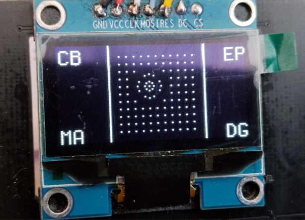

# Open NSynth Super SH1106

This is slightly modified sources of Open NSynth Super for work with SH1106 OLED screen instead of SSD1306.
If you use your OLED with pin DC=0 (not connected or tied to GND), the default address of your SH1106 will be 0x3c,
Otherwise (pin DC=1 or connected to 3.3V), SH1106 address will be 0x3d and you don't need to replace or change original src/ofApp.h
To know what I2C address is used with your OLED run 'i2cdetect -y 1'

### Notes
The files which was changed:
1. 
2. 

### Replacing the source

0. sudo mount -o remount,rw /
1. Place the OledScreenDriver.cpp and ofApp.h somewhere in Raspberry Pi 
2. cp ofApp.h /home/pi/opt/of/apps/open-nsynth/open-nsynth/src/
3. cp OledScreenDriver.cpp /home/pi/opt/of/apps/open-nsynth/open-nsynth/src/

You don't need step 2 if your OLED is sitting on 0x3d I2C address.

### Rebuilding source

1. cd /home/pi/opt/of/apps/open-nsynth/open-nsynth/
2. make clean
3. make
4. sudo reboot
5. .. PROFIT! your device will start with the new compiled app 

### Original source
The original project 
